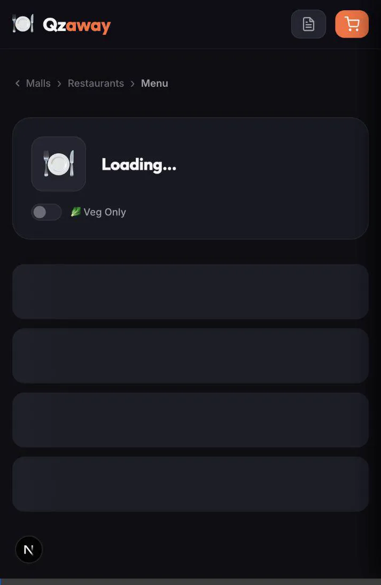

# 🍽️ Qzaway — Mall Food Court Ordering

A premium, dark-themed food ordering frontend for mall food courts. Browse restaurants, explore menus, manage your cart with GST breakdown, and place orders — all in a sleek, responsive UI.


## Demo

### Desktop


### Mobile


### Seamless Cart Interactions


## Features

- 🏬 **Mall Selection** — Choose your mall to see available restaurants
- 🔍 **Search & Filter** — Search dishes across restaurants, toggle veg-only
- 📋 **Category Menus** — Browse items grouped by category with veg/non-veg indicators
- 🛒 **Smart Cart** — Add items, adjust quantities, view real-time price breakdown
- 💰 **GST Breakdown** — Food GST (5%), platform fee, platform GST (18%)
- 📦 **Order Placement** — Place orders and track history
- 🔄 **Reorder** — Quick reorder from past orders
- 📱 **Responsive** — Works on desktop and mobile with back navigation

## Tech Stack

| Layer | Technology |
|-------|-----------|
| Framework | Next.js 16 (App Router) |
| Styling | CSS Modules + CSS Custom Properties |
| State | React Context API |
| Backend | [Qzaway API](https://qzaway-backend.onrender.com/docs) |

## Getting Started

```bash
npm install
npm run dev
```

Open [http://localhost:3000](http://localhost:3000).

## API

Connected to the live backend at `https://qzaway-backend.onrender.com`. See [Swagger Docs](https://qzaway-backend.onrender.com/docs) for all endpoints.

## License

MIT
